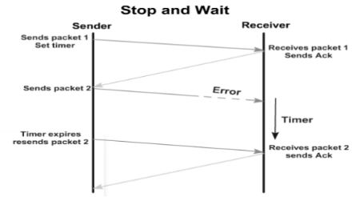
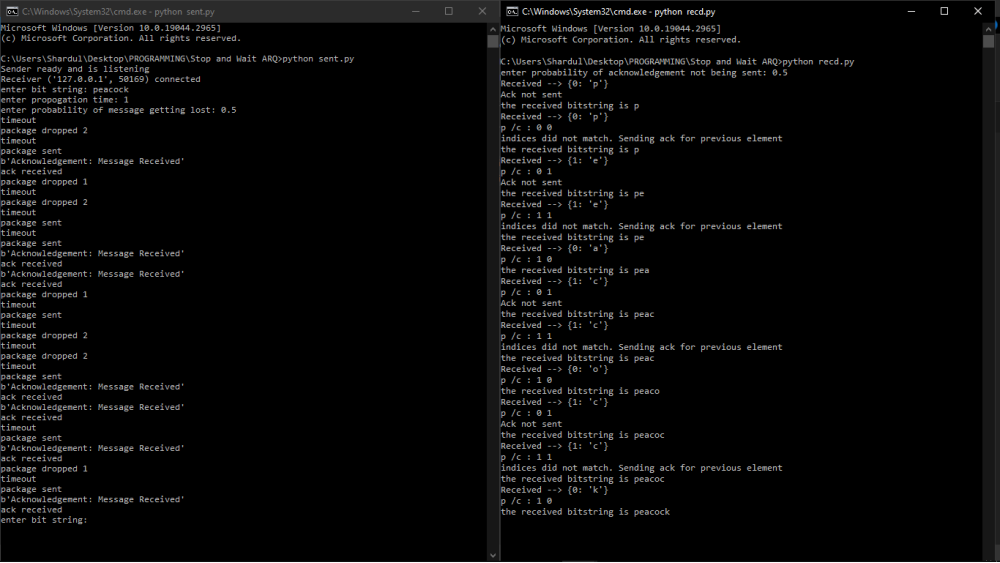

# Stop-and-Wait-ARQ-using-Python

## Introduction
Stop-and-Wait ARQ (Automatic Repeat Request) is a simple error control protocol used in data communication. Stop-and-Wait ARQ ensures reliable transmission by transmitting one data frame at a time and waiting for an acknowledgment before sending the next frame. After sending a frame, the sender waits for an acknowledgment from the receiver. If no acknowledgment is received within a specified timeout period, the sender retransmits the frame. The receiver checks for errors in the received frame and sends an acknowledgment indicating successful reception or requests retransmission if errors are detected. It provides error detection but requires additional mechanisms, such as sequence numbers and timers, to handle lost or corrupted frames. Stop-and-Wait ARQ is simple and reliable but can suffer from low efficiency due to the waiting time for acknowledgments, especially over long-delay or high-error-rate channels.

  
  
Stop and Wait Process

## The Sender Part

The sender send the string with some basic inputs such as the string to be transmitted, propagation time, and gthe probability of the mesage getting lost.

## Receiver End

The receiver has to also enter an input which is the probability of acknowledgement not being sent after entering this input the transmission starts. 

## Code in Action

  
  
Stop and Wait Process

